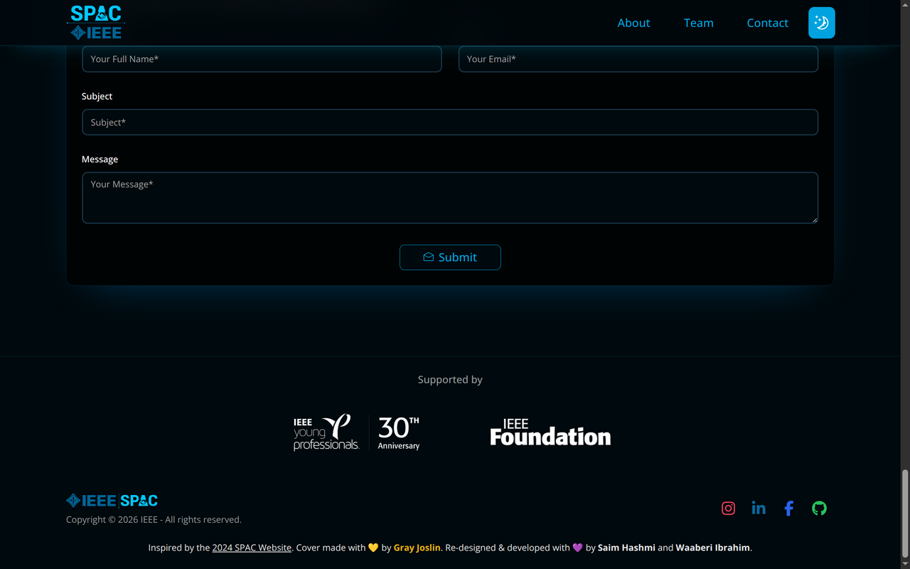
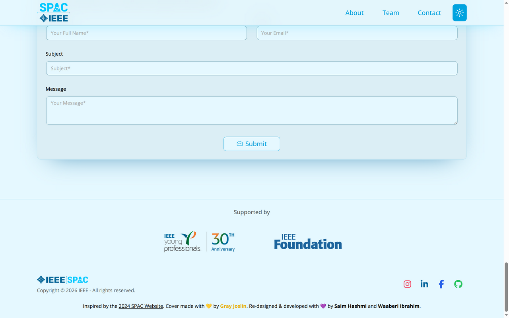
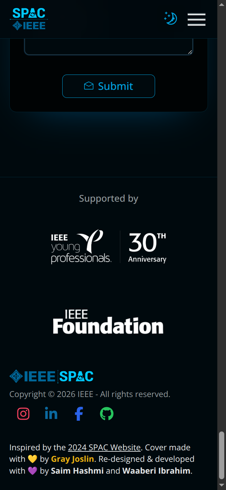
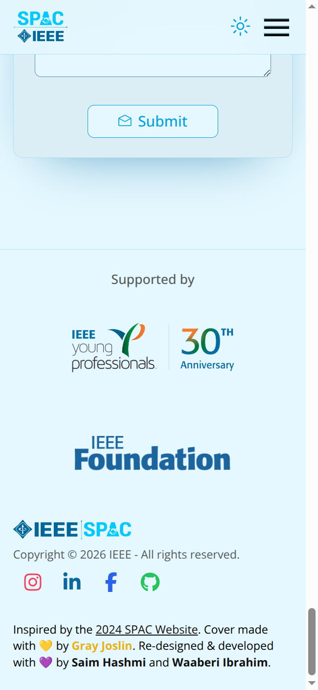

# SPAC 2026 funding acknowledgment

The event funding notice requires the IEEE Young Professionals and IEEE Foundation logos on promotional materials and encourages the IEEE YP 30th Anniversary mark. The website acknowledges both organizations in the existing footer.

## Official sources

- [IEEE YP Templates and Graphics](https://yp.ieee.org/volunteers/templates-and-graphics/)
- [Official 30th Anniversary artwork ZIP](https://yp.ieee.org/wp-content/uploads/2026/05/IEEE-YP-@-30-Logo.zip)
- [IEEE YP identity guidelines](https://yp.ieee.org/wp-content/uploads/2022/02/How-to-use-YP-Logo.pdf), pages 4, 7 and 8: complete name/mark, minimum size, clear space and background control.
- [IEEE Foundation Brand Toolkit](https://www.ieeefoundation.org/brand-toolkit/): official artwork, 135 px minimum web width and isolation area.
- [IEEE Foundation visual identity guide](https://www.ieeefoundation.org/wp-content/uploads/2023/04/23-ca-3-009-FP-IEEEFoundation-VisualIdentityGuidelines-FNL-Interactive.pdf), pages 1–2: proportions, color, spacing and program partner use.

## Artwork provenance

All four PNG files in `public/assets/ieee/` are byte-for-byte copies of the official downloads. Only filenames changed. The images are served unoptimized, without cropping, recoloring, filters, opacity changes or animation.

| Local filename                     | Official source                                                                                                       |
| ---------------------------------- | --------------------------------------------------------------------------------------------------------------------- |
| `young-professionals-30-color.png` | `YP@30_Colour@4x.png` in the anniversary ZIP                                                                          |
| `young-professionals-30-white.png` | `YP@30_White@4x.png` in the anniversary ZIP                                                                           |
| `foundation-blue.png`              | [Foundation RGB PNG](https://www.ieeefoundation.org/wp-content/uploads/2023/01/21-FOUN-2003_new_wordmark_RGB.png)     |
| `foundation-white.png`             | [Foundation white PNG](https://www.ieeefoundation.org/wp-content/uploads/2023/02/21-FOUN-2003_new_wordmark_WHITE.png) |

## Placement and measurements

- Light mode uses the supplied color artwork on the existing plain light footer. Dark mode uses the supplied white artwork on the existing plain dark footer. No decorative background is introduced.
- The complete YP anniversary image is 216 × 71.72 CSS px, with 36 px padding on every side. This exceeds half the height of the entire anniversary artwork; the stacked YP mark within it also exceeds the guideline's 70 px minimum. The full name and trademark are retained.
- The Foundation image is 192 CSS px wide, with approximately 190 px of visible artwork, above the 135 px minimum. Its original aspect ratio is retained separately for each source PNG. The 36 px padding exceeds the height of the lettering, satisfying both the toolkit's isolation rule and the guide's digital half-height rule.
- Each mark is a separate link to its organization's website, with descriptive alternative text and the existing keyboard focus treatment. The marks wrap to separate rows on narrow screens rather than shrinking below their required sizes.

## Verification

- Production build: `pnpm build` passed using the committed pnpm lockfile (Next.js 16.3.1).
- ESLint passed for the three affected components. Repository-wide `pnpm lint` is blocked by existing YAML formatting errors in archived `.playwright-mcp` snapshots; those files are outside this change.
- Asset byte comparisons against the downloads passed for all four PNGs.
- Browser measurements at 320, 390, 768 and 1440 px confirmed the above logo sizes and spacing, loaded images and no horizontal page overflow.
- Axe WCAG 2 A/AA and 2.1 AA checks of the new acknowledgment returned no violations or incomplete checks in either theme. Keyboard Tab moves between both organization links with a visible focus outline.
- Screenshots below are from the production build. The existing page styling and content remain unchanged apart from the footer acknowledgment.

| Dark mode                         | Light mode                          |
| --------------------------------- | ----------------------------------- |
|  |  |
|    |    |

This change covers the website. Separately produced flyers, social graphics, emails and slide decks still need to carry both marks when created or updated.
